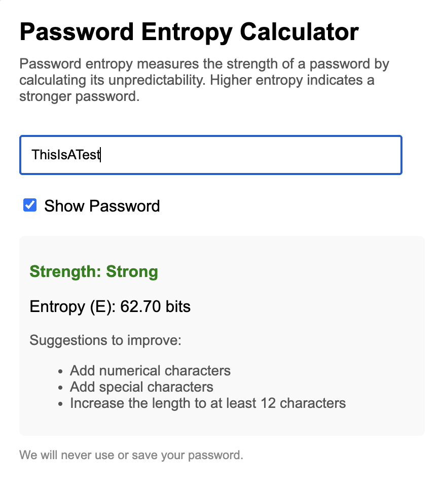

# Password Strength Tester
This program will allow a user to test a theoretical password and measure the strength of a password based on the calculated password entropy. I utilized ChatGPT to generate the embeddable HTML version of the Python logic.

### What is Password Entropy?
According to [Pleacher](https://www.pleacher.com/mp/mlessons/algebra/entropy.html), Password Entropy represented by E is the opposite of an ordered pattern. Entropy is good: the bigger the E, the harder a password is to crack.

The formula is:

`E = log_2(R^L)`

Where E = Password Entropy, R = Pool of Unique Characters, and L = Number of Characters in your Password. Then R^L = Number of Possible Passwords. 

### What is the Entropy Scale Used?
 - Very Weak: <30 bits of E
 - Weak: 30-50 bits of E
 - Decent: 50-60 bits of E
 - Strong: 60-80 bits of E
 - Very Strong: 80 bits of E

 ### Screenshot

 
